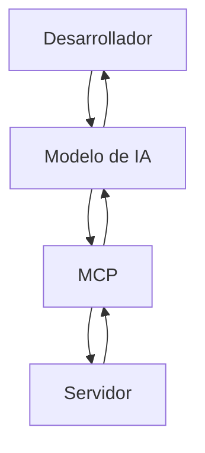

## Model Context Protocol (MCP), 

- Un protocolo de comunicación que está revolucionando la forma en que los modelos de lenguaje, como ChatGPT y Claude, se conectan con el mundo exterior. Este protocolo permite la interacción efectiva entre modelos de inteligencia artificial y servicios externos como APIs y bases de datos.

- A menudo te habrás encontrado con que al utilizar un modelo de IA, como ChatGPT, sus capacidades pueden sentirse limitadas. Por ejemplo, no puedes pedirle que cree un repositorio o que realice una pull request directamente en plataformas como GitHub. Aquí es donde el MCP juega un papel crucial, permitiendo acciones más complejas y en tiempo real.

## Cómo funcionan

- **Cliente** : Un desarrollador interactúa con el modelo de IA.
- **Acción:** El desarrollador solicita una acción específica (por ejemplo, crear un repositorio).
- **MCP**: El MCP actúa como intermediario entre la IA y un servidor externo.
- **Respuesta**: El servidor procesa la solicitud y responde a la IA, que luego presenta la información al usuario.



## Gracias al MCP, las IA pueden:

- Conectarse a APIs.
- Realizar consultas a bases de datos.
- Ejecutar funciones en el sistema de archivos del ordenador.

### Instalar MCPs desde la web
Link MCP Disponibles:
https://github.com/mcp?utm_source=vscode-website&utm_campaign=mcp-registry-server-launch-2025

## Instalar desde vs code
- .vscode/mcp.json
```json
{
  "servers": {
    "github-mcp": {
      "type": "http",
      "url": "https://api.githubcopilot.com/mcp"
    }
  }
}
```

## Podemos ir a la lista de mcp en mcp.json y ejecutar/detener desde allí


## Probemos el MCP de github
- Creemos un nuevo proyecto y decirle a copilot que cree su repositorio.

## Probemos el MCP de Figma
- Generemos una pantalla simple pero probando las tools de descargar imagenes.

