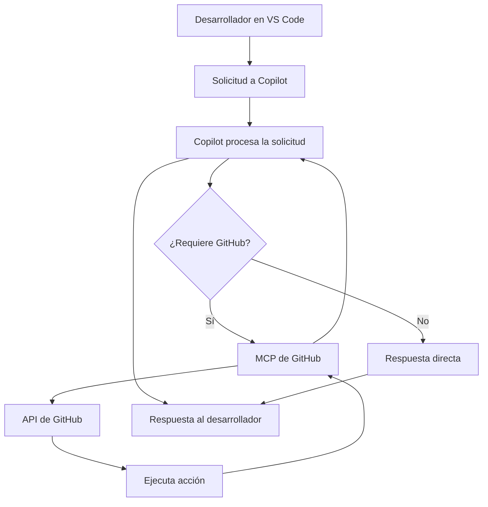

# MCP GitHub - Integración de GitHub con Copilot

## ¿Qué es el MCP de GitHub?

El MCP (Model Context Protocol) de GitHub es un servidor que permite a GitHub Copilot interactuar directamente con la API de GitHub. Esto significa que puedes pedirle a Copilot que realice operaciones en GitHub sin salir de tu editor de código.

## Capacidades del MCP de GitHub

Con el MCP de GitHub habilitado, Copilot puede realizar las siguientes acciones:

### 📁 Gestión de Repositorios
- Crear nuevos repositorios
- Listar repositorios existentes
- Obtener información detallada de un repositorio
- Buscar repositorios por nombre o descripción
- Ver el contenido de archivos y directorios

### 📝 Issues
- Crear nuevas issues
- Listar issues abiertas o cerradas
- Obtener detalles de una issue específica
- Buscar issues por etiquetas, estado o autor
- Agregar comentarios a issues existentes

### 🔀 Pull Requests
- Crear pull requests
- Listar pull requests por estado
- Obtener detalles de un PR específico
- Ver los archivos modificados en un PR
- Obtener el diff de un pull request
- Ver reviews y comentarios
- Verificar el estado de checks/tests

### 🏷️ Releases y Tags
- Listar releases de un repositorio
- Obtener información de una release específica
- Ver tags disponibles

### 📊 Commits y Branches
- Listar commits de una rama
- Obtener detalles de un commit específico (incluyendo diff)
- Listar branches de un repositorio

### ⚙️ GitHub Actions
- Listar workflows de un repositorio
- Ver runs de workflows
- Obtener logs de jobs fallidos
- Analizar errores en workflows

### 🔐 Seguridad
- Listar alertas de escaneo de código
- Ver alertas de escaneo de secretos
- Obtener detalles de alertas de seguridad específicas

## Configuración del MCP de GitHub

### Requisitos Previos
- GitHub Copilot instalado en VS Code
- Cuenta de GitHub activa
- Acceso a los repositorios que deseas gestionar

### Instalación

El MCP de GitHub viene preinstalado con GitHub Copilot, pero necesitas habilitarlo:

1. Abre VS Code
2. Ve a la configuración de Copilot Chat
3. En la sección de herramientas, verifica que el MCP de GitHub esté habilitado
4. Si no está habilitado, actívalo desde la configuración

También puedes configurarlo manualmente en `.vscode/mcp.json`:

```json
{
  "servers": {
    "github-mcp": {
      "type": "http",
      "url": "https://api.githubcopilot.com/mcp"
    }
  }
}
```

## Ejemplos Prácticos

### Ejemplo 1: Crear un nuevo repositorio

```
Prompt: "Crea un repositorio llamado 'my-new-project' 
con la descripción 'Mi proyecto de ejemplo' en mi cuenta de GitHub"
```

Copilot utilizará el MCP para:
1. Autenticar con GitHub
2. Crear el repositorio
3. Confirmar la creación y proporcionar el URL

### Ejemplo 2: Buscar issues abiertas

```
Prompt: "Muéstrame todas las issues abiertas en el repositorio 
'eduardoorm/workshop-github-ia'"
```

Copilot listará todas las issues abiertas con su título, número y estado.

### Ejemplo 3: Crear una Pull Request

```
Prompt: "Crea una pull request desde la rama 'feature/nueva-funcionalidad' 
hacia 'main' con el título 'Añadir nueva funcionalidad' 
y descripción 'Esta PR implementa la funcionalidad solicitada'"
```

### Ejemplo 4: Ver el contenido de un archivo

```
Prompt: "Muéstrame el contenido del archivo README.md 
del repositorio 'eduardoorm/workshop-github-ia'"
```

### Ejemplo 5: Analizar errores de CI/CD

```
Prompt: "¿Por qué falló el último workflow de GitHub Actions 
en mi repositorio?"
```

Copilot analizará los logs del workflow fallido y te explicará qué salió mal.

### Ejemplo 6: Buscar código en GitHub

```
Prompt: "Busca funciones en JavaScript que implementen 
autenticación JWT en repositorios públicos de GitHub"
```

## Flujo de Trabajo con MCP de GitHub



## Mejores Prácticas

### ✅ Hacer
- Sé específico en tus solicitudes (nombre de repositorio, rama, etc.)
- Utiliza el MCP para automatizar tareas repetitivas
- Verifica las acciones antes de confirmarlas (Copilot pedirá permiso)
- Aprovecha el MCP para explorar repositorios y entender código

### ❌ Evitar
- No intentes realizar acciones sin los permisos necesarios
- No olvides revisar las pull requests creadas por Copilot
- No dependas únicamente del MCP para operaciones críticas sin verificación

## Permisos y Autenticación

El MCP de GitHub utiliza tu autenticación existente de GitHub Copilot. Asegúrate de que:

- Tu token de GitHub Copilot esté activo
- Tengas los permisos necesarios en los repositorios que quieres modificar
- Tu organización permita el uso de GitHub Copilot (si trabajas en una empresa)

## Casos de Uso Avanzados

### Automatización de Workflows
Puedes pedirle a Copilot que:
- Cree issues automáticamente basándose en comentarios TODO en el código
- Genere pull requests para cambios masivos
- Sincronice información entre múltiples repositorios

### Análisis de Código
- "Encuentra todos los archivos TypeScript en este repositorio que usen una API específica"
- "Muéstrame los commits recientes que modificaron la autenticación"
- "¿Qué pull requests están esperando mi revisión?"

### Gestión de Proyectos
- "Lista todas las issues etiquetadas como 'bug' y 'prioridad alta'"
- "¿Cuáles son las releases recientes y qué cambios incluyen?"
- "Muéstrame el estado de los checks de CI en la última PR"

## Limitaciones

- El MCP de GitHub depende de la API de GitHub, por lo que tiene las mismas limitaciones de rate limiting
- Algunas operaciones pueden requerir permisos especiales (como crear releases)
- El MCP no puede realizar operaciones que requieran autenticación de dos factores en tiempo real

## Recursos Adicionales

- [Documentación oficial de GitHub Copilot](https://docs.github.com/copilot)
- [GitHub REST API](https://docs.github.com/rest)
- [Lista de MCPs disponibles](https://github.com/mcp)

## Ejercicios Prácticos

### Ejercicio 1: Exploración de Repositorio
1. Usa Copilot con MCP para explorar un repositorio público
2. Lista sus branches principales
3. Muestra las últimas 5 issues creadas
4. Ve el contenido del archivo CONTRIBUTING.md (si existe)

### Ejercicio 2: Creación de Issue
1. Crea una nueva issue en tu repositorio de práctica
2. Añade etiquetas apropiadas
3. Verifica que la issue se haya creado correctamente en GitHub

### Ejercicio 3: Análisis de Pull Request
1. Selecciona una PR abierta en cualquier repositorio
2. Pide a Copilot que analice los cambios
3. Solicita un resumen de las modificaciones
4. Verifica el estado de los checks

### Ejercicio 4: Búsqueda de Código
1. Busca ejemplos de implementación de una funcionalidad específica
2. Analiza los resultados con ayuda de Copilot
3. Compara diferentes enfoques encontrados

## Conclusión

El MCP de GitHub transforma a Copilot en un asistente completo para la gestión de repositorios. Al integrarse directamente con la API de GitHub, elimina la necesidad de cambiar entre tu editor y el navegador, permitiéndote mantener tu flujo de trabajo sin interrupciones.

Con el MCP de GitHub puedes:
- 🚀 Aumentar tu productividad
- 📊 Tener mejor visibilidad de tus proyectos
- 🤝 Colaborar más eficientemente
- 🔍 Explorar código de manera más intuitiva

¡Empieza a usar el MCP de GitHub y lleva tu desarrollo al siguiente nivel!
